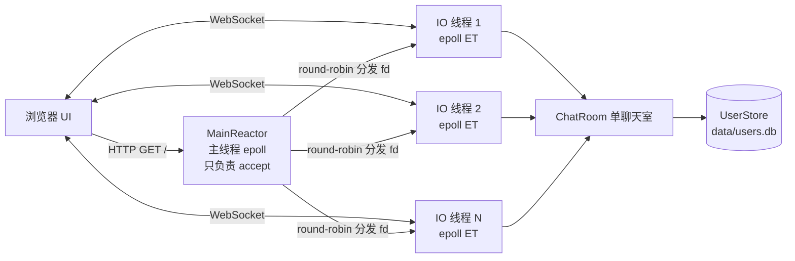

# 基于高并发 epoll 的 C++ 聊天室测试

> MyChatServer · 多 Reactor（epoll ET）+ WebSocket + 注册登录 + 点击式前端 UI

一个从"回音壁"演进而来的**单聊天室**服务器：C++17 手写，无任何第三方依赖，
自带前端页面、注册登录、日志系统与端到端测试。

> 旧版单体回音壁代码已归档到 `legacy/`，不再参与构建。

## 特性

| 分类 | 说明 |
|---|---|
| 并发模型 | 主线程 accept + N 个 IO 线程各持一个 epoll（one loop per thread），全部 EPOLLET 边沿触发 |
| 通信协议 | WebSocket（RFC 6455 服务端子集），消息体为 JSON |
| 账号体系 | 注册 / 登录 / 登出，密码 `SHA256(salt:password)` 加盐哈希落盘，**绝不明文存储** |
| 聊天室 | 固定单房间「大厅」，进入后**不显示历史消息**（服务器不保存任何聊天记录） |
| 前端 | 纯静态页面，与 WebSocket **共用同一端口**，全部操作点击完成 |
| 心跳 | 服务端每 30s 主动 ping；120s 无任何数据判定为空闲超时并断开 |
| 日志 | 分级（debug/info/warn/error）、带时间戳/线程号/源码位置，同时输出终端与文件 |
| 健壮性 | 限流、帧长上限、写缓冲背压、连接数上限、优雅退出信号处理 |

## 快速开始

```bash
make            # 编译，产物 chat_server
make run        # 启动（默认端口 8888）
```

### 从 GitHub 克隆后运行

```bash
git clone https://github.com/<你的用户名>/cpp-epoll-chatroom.git
cd cpp-epoll-chatroom
make            # 编译
make run        # 启动，然后浏览器打开 http://127.0.0.1:8888/
```

**运行环境要求**

| 依赖 | 版本 | 说明 |
|---|---|---|
| Linux | — | 依赖 `epoll` / `eventfd` / `accept4`，不支持 Windows/macOS |
| g++ | 支持 C++17（GCC 7+） | 无任何第三方库 |
| make | — | 或直接手敲 `g++ -std=c++17 -O2 -pthread -o chat_server main.cpp common/*.cpp net/*.cpp app/*.cpp` |
| Python 3 | 3.6+ | 仅跑 `make test` 时需要（纯标准库） |

然后浏览器打开 **<http://127.0.0.1:8888/>**（服务器默认监听 `0.0.0.0`，同一局域网的其他人
可用 `http://<你的IP>:8888/` 访问，启动日志里会直接打印该地址）：

1. 点击「注册」→ 填写用户名/密码 → 点击「注册」
2. 自动切回「登录」→ 点击「登录」→ 进入大厅
3. 在底部输入框输入内容 → 点击「发送」（或按 Enter）
4. 右上角「退出登录」可退出；点击左侧在线用户名可快速 `@` 对方

### 命令行参数

```
./chat_server [选项]
  -b, --bind <地址>      监听地址（默认 0.0.0.0 = 所有网卡；只想本机访问用 127.0.0.1）
  -p, --port <端口>      监听端口（默认 8888）
  -t, --threads <数量>   IO 线程数（默认 4）
  -d, --db <路径>        用户库文件（默认 data/users.db）
  -w, --web <目录>       前端静态目录（默认 web）
  -l, --log <文件>       日志文件（默认 logs/server.log）
  -L, --level <级别>     debug|info|warn|error（默认 info）
  -h, --help             显示帮助
```

### 让局域网/其它机器访问

默认就监听 `0.0.0.0`（所有网卡），启动时日志会直接列出可用地址：

```
监听地址 0.0.0.0:8888，IO 线程 4
本机访问: http://127.0.0.1:8888/
局域网/外部访问: http://192.168.1.10:8888/     ← 同一局域网的人用这个
```

同一局域网的其他人用上面的地址即可打开页面并聊天。若要走公网，还需在路由器做端口映射/放行防火墙（如 `firewalld`：`sudo firewall-cmd --add-port=8888/tcp`）。

> 只允许本机访问时启动加 `-b 127.0.0.1`；填其它具体 IP（如 `-b 192.168.1.10`）则只绑定该网卡。
> 填错格式（例如 `999.1.1.1`）会在启动时被拒绝并给出明确提示。

## 部署到云服务器

### 1. 上传代码

```bash
# 方式一：从 GitHub 克隆
git clone https://github.com/<用户名>/cpp-epoll-chatroom.git /opt/chat_server

# 方式二：本机传到服务器（在你自己电脑上执行）
scp -r ./ root@<服务器公网IP>:/opt/chat_server
```

### 2. 安装编译环境

```bash
# CentOS / RHEL / openEuler / 阿里云 Linux
sudo yum install -y gcc-c++ make

# Ubuntu / Debian
sudo apt update && sudo apt install -y g++ make

g++ --version    # 需要 GCC 7+（C++17）
```

> CentOS 7 自带 gcc 4.8 太老，需装 devtoolset：
> `sudo yum install -y centos-release-scl && sudo yum install -y devtoolset-11-gcc-c++`
> 之后用 `scl enable devtoolset-11 bash` 进入环境再编译。

### 3. 编译并启动

```bash
cd /opt/chat_server
bash deploy/deploy.sh            # 一键：检查环境 + 编译 + 启动
```

或手动：

```bash
make -j$(nproc)                  # 编译
mkdir -p data logs

./chat_server                    # 前台启动（Ctrl+C 停止，SSH 断开即退出）
nohup ./chat_server >/dev/null 2>&1 &   # 后台启动
```

**必须保持项目根目录为工作目录**：`-w web`、`-d data/users.db`、`-l logs/server.log`
都是相对路径，换目录要用参数指定绝对路径。

### 4. 用 systemd 托管（推荐：开机自启 + 崩溃自动重启）

```bash
sudo mkdir -p /opt/chat_server
sudo cp -r ./* /opt/chat_server/           # 若已在该目录可跳过

# 用脚本一步到位（自动改好路径并 enable）
bash deploy/deploy.sh --install-systemd /opt/chat_server

# 或手动安装
sudo cp deploy/chat_server.service /etc/systemd/system/
sudo vim /etc/systemd/system/chat_server.service   # 改 WorkingDirectory / ExecStart 路径
sudo systemctl daemon-reload
sudo systemctl enable --now chat_server
```

常用命令：

```bash
sudo systemctl status chat_server      # 查看状态
sudo systemctl restart chat_server     # 重启
sudo systemctl stop chat_server        # 停止
sudo journalctl -u chat_server -f      # 跟 systemd 日志
tail -f logs/server.log                # 跟程序自己的日志
```

### 5. ⚠️ 开放端口（云服务器最常见的"打不开"原因）

有两个地方要放行，**缺一不可**：

1. **云厂商安全组**（控制台操作）：在实例的「安全组 / 防火墙」里添加入方向规则
   `TCP : 8888`（或你使用的端口），来源 `0.0.0.0/0`。
   阿里云/腾讯云/华为云/AWS 都必须做这一步。
2. **服务器本机防火墙**：

```bash
# firewalld（CentOS 系）
sudo firewall-cmd --permanent --add-port=8888/tcp && sudo firewall-cmd --reload

# ufw（Ubuntu 系）
sudo ufw allow 8888/tcp

# 查看监听是否正常
ss -ltnp | grep 8888        # 应显示 0.0.0.0:8888
```

之后用 **`http://<服务器公网IP>:8888/`** 打开页面即可注册、登录、聊天。

> 想用 80 端口（浏览器地址不带端口）：`./chat_server -p 80` 需要 root 或
> `sudo setcap 'cap_net_bind_service=+ep' /opt/chat_server/chat_server`。

### 6. 排查清单

| 现象 | 原因与处理 |
|---|---|
| 浏览器一直转圈/连接被拒绝 | 安全组或本机防火墙没放行；用 `ss -ltnp \| grep 端口` 确认在监听 |
| 页面 404 / 样式丢失 | 工作目录不对，`web/` 没被找到；检查 systemd 的 `WorkingDirectory` |
| `bind ... 失败: Address already in use` | 端口被占用：`ss -ltnp \| grep 8888`，或 `pkill -f chat_server` |
| `make` 报 C++17 相关错误 | gcc 太老，见上面 devtoolset 说明 |
| 服务起不来，`systemctl status` 显示 203/EXEC | `ExecStart` 路径写错或文件无执行权限（`chmod +x chat_server`） |
| 用户数据丢失 | `data/` 是相对路径；换成绝对路径或固定工作目录 |

## 架构



- **每个连接固定属于一个 IO 线程**，其读写全部在该线程完成，热路径无锁。
- **广播是跨线程的**：`ChatRoom::broadcast` 把消息投递给每个连接所属的 `EventLoop`（`runInLoop` + eventfd 唤醒），由各自线程发送。
- 连接对象用 `shared_ptr` + `weak_ptr` 管理，事件回调先 `lock()` 提升引用，保证回调期间不会被析构；连接析构始终发生在它自己的 loop 线程。

## 目录结构

```
├── main.cpp              启动器：参数解析、日志初始化、信号处理
├── Makefile
├── common/
│   ├── Logger.{h,cpp}    线程安全分级日志
│   ├── Buffer.{h,cpp}    缓冲区（历史堆越界 bug 已修复，见下）
│   ├── json.{h,cpp}      极简 JSON 解析/生成（无第三方依赖）
│   ├── crypto.{h,cpp}    SHA1 / SHA256 / Base64 / 随机盐
│   └── protocol.h        消息类型与各类上限常量
├── net/
│   ├── EventLoop.{h,cpp} epoll + eventfd 唤醒 + 定时器
│   ├── Connection.{h,cpp} WebSocket 握手/帧收发/心跳/背压
│   ├── TcpServer.{h,cpp}  多 Reactor 监听与连接分发
│   └── WebSocket.{h,cpp}  RFC6455 服务端子集（握手 + 帧编解码）
├── app/
│   ├── UserStore.{h,cpp}  注册登录与用户库持久化
│   ├── ChatRoom.{h,cpp}   单聊天室（无历史消息）
│   ├── ChatServer.{h,cpp} 业务组装与消息分发
│   └── HttpStatic.{h,cpp} 同端口静态文件服务
├── web/                  前端（index.html / app.js / style.css）
├── deploy/
│   ├── chat_server.service  systemd 服务单元（开机自启 + 崩溃重启）
│   └── deploy.sh            一键部署脚本（查环境 + 编译 + 可选装服务）
├── tests/test_chat_server.py  端到端测试（纯标准库手写 WebSocket 客户端）
├── data/users.db         用户库（运行时生成）
├── logs/server.log       日志（运行时生成）
└── legacy/               旧版回音壁代码（仅存档，不参与构建）
```

## 应用层协议

WebSocket 文本帧，内容是 JSON 对象，以 `type` 区分。

**客户端 → 服务端**

| type | 字段 | 说明 |
|---|---|---|
| `register` | `username`, `password` | 注册 |
| `login` | `username`, `password` | 登录 |
| `logout` | — | 登出（连接保留，可再次登录） |
| `chat` | `text` | 发言（需已登录） |

**服务端 → 客户端**

| type | 字段 | 说明 |
|---|---|---|
| `register_result` | `ok`, `reason`/`message` | 注册结果 |
| `login_result` | `ok`, `username`, `room`, `users[]`, `history:false` | 登录结果 |
| `chat` | `from`, `text`, `time` | 聊天室消息广播 |
| `system` | `text`, `time` | 系统通知（进入/离开） |
| `user_list` | `users[]`, `count` | 在线用户列表 |
| `error` | `reason` | 错误提示 |

## 测试

```bash
make test     # 端到端测试：自动拉起服务器 + 21 组用例 / 34 项断言
```

覆盖握手、静态页面、注册登录、广播、**新用户看不到历史消息**、重复登录拒绝、
限流、超长消息、超大帧、二进制帧、非法 JSON、分片消息、ping/pong、20 并发客户端等。

WebSocket 帧与会话由测试脚本**手写实现**（不依赖 `websocket-client` 等第三方库），
因此也能反过来校验服务端组帧是否符合 RFC。

## 健壮性措施一览

- `Buffer` 扩容判定修正（历史 bug：`readable + writable >= len` 恒真导致堆越界，见 `legacy/`）
- EPOLLET 下读/写均循环到 `EAGAIN`，写不完自动挂 `EPOLLOUT`
- 写缓冲超过 4MB 判定对端"只连不收"，直接断开
- 单条消息上限 64KB（帧）、聊天内容上限 2000 字节、握手请求头上限 8KB
- 请求级限流：5 秒 30 条，超限返回 `error`
- 连接数上限 10000，超限直接拒绝新连接
- 空闲 120s 自动断开，避免半开连接堆积
- 广播前先拷贝连接列表，避免遍历中连接被析构
- 静态文件服务过滤路径穿越（`..`）
- 密码加盐哈希 + 常量时间比较语义（同盐同密码结果一致），重复登录被拒绝
- SIGINT/SIGTERM 通过 eventfd 唤醒主循环，实现优雅退出

## 已知限制

- 聊天室固定为一个，没有多房间/私聊
- 不保存历史消息（这是**有意设计**，符合"进入后看不到之前聊天内容"的需求）
- 用户库为单文件追加写，适合中小规模；如需更高并发建议换数据库
- 未实现 WebSocket 扩展（permessage-deflate）与二进制业务消息
